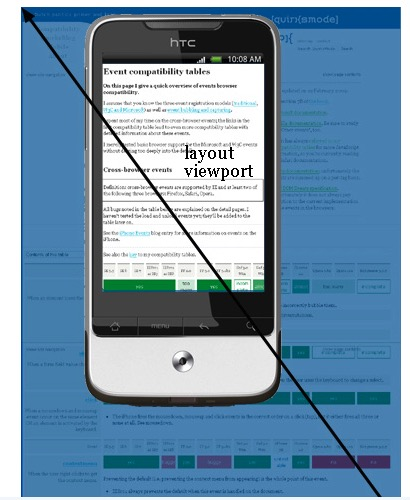
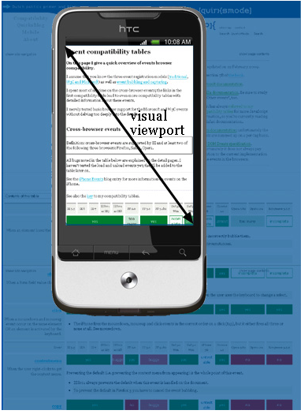

# 浏览器相关

## cookie

**存储**cookie是**浏览器**提供的功能
当网页要发http请求时，浏览器会先检查是否有相应的cookie，有则自动添加在request header中的cookie字段中

每个域名下的 cookie 的大小最大为4KB，每个域名下的cookie数量最多为20个

### 属性

#### name
名
#### value
值
#### domain
可以访问该Cookie的域名，如果设置为“.google.com”，则所有以“google.com”结尾的域名都可以访问该Cookie
domain 默认为当前 url
::: tip
第一个字符必须为“.”
:::
#### path
Cookie的使用路径。如果设置为“/sessionWeb/”，则只有contextPath为“/sessionWeb”的程序可以访问该Cookie。如果设置为“/”，则本域名下contextPath都可以访问该Cookie。注意最后一个字符必须为“/”。
::: tip
最后一个字符必须为“/”
:::
#### expires/Max-Age
字段为此cookie超时时间。若设置其值为一个时间，那么当到达此时间后，此cookie失效
#### Size
大小
#### http　　
只有在https请求头中会带有此cookie的信息，而不能通过document.cookie来访问此cookie
#### secure
设置是否只能通过https来传递此条cookie


## meta viewport
移动端的布局与pc端不同,css上的1px不同于物理上的1px,分辨率越来越高,尺寸越来越小,意味着1个物理像素内有好几个像素

window 对象有一个 devicePixelRadio 可以告诉我们在一个物理像素内包含了多少像素,但这个属性还有兼容性问题,我们不能完全信任它

layout viewport: 表示网页的所有内容



visual viewport: 可见的内容



移动端默认的浏览器宽度要大于实际屏幕的宽度
``` html
<meta name="viewport" content= "width=device-width, initial-scale=1.0,maximum-scale=1.0,minimum-scale=1.0,user-scale=0"/>
```

